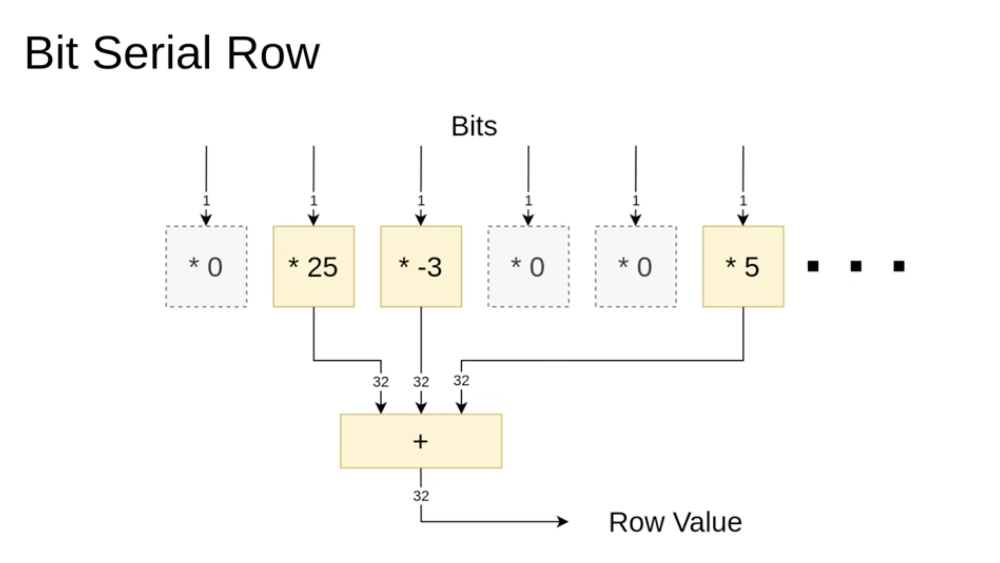

# BitSerialMatrix

The bit-serial matrix multiplication is an example where SUS truly shines.

The bit-serial matrix multiplication essentially takes a compile-time matrix, ideally a sparse one, and processes the input data bit by bit for each input vector element. This approach ensures that the multiplications within the matrix involve only multiplications by one or zero, which is far cheaper to implement than full-size multipliers.

## Datapath

When designing a new SUS architecture, it's important to start by drawing out how you want the data flow to look. In this case, I've outlined the bit-serial multiplication process. At the top, we have bit shifters that store the input vector and sequentially output bits over 32 cycles, starting from the most significant bit. These bits are then fed into the matrix rows, where multiplications by one or zero take place. The summed results are accumulated and shifted left every cycle, producing the final result after 32 cycles.

## Bit Serial Row

n one of these bit-serial rows, we've passed a vector of specific values. Some of these values are zero, and we want to filter them out first. This way, we only sum the values that were not multiplied by zero. Essentially, our goal is to implement this filtering step so that, in the end, we only add the relevant three values together. Here's how it should work.

# Bit SerialRow Code

At the top, a Ro block defines the size and weight list as template parameters. The interface is purely combinatorial. The first step is counting all nonzero elements, which is necessary for now since SUS doesn’t support resizable vectors. Once that feature is available, this step will no longer be needed.

A special case occurs when all values are zero, in which case the output is simply zero. Otherwise, the nonzero elements are filtered, keeping only those where the corresponding bit is set to one. This process happens at compile time.

Once the relevant values are gathered, they are passed to a three-add module, which sums them up to produce the final output.

A quick note on the three-add module: it is pipelined, with a pipeline depth that adjusts dynamically based on the number of values. The compiler efficiently handles this variation—some instances may take two cycles, others four cycles, but everything runs smoothly.

# BitSerialMatrixMultiplyState

Now, we have the accumulators for the bit-serial matrix multiplication.

Once again, we define the width, height, and weight matrix as parameters. The design includes some state, specifically the cumulative sum. All row submodules—which are the individual matrix multipliers—are instantiated within this structure.

There are two interfaces:

Start interface – Initializes the entire system when called.
Feed interface – Adds the current bit and shifts the result left.
This is how it would be written in SUS.

# BitShifter

Next, we have the bit shifter.

Once again, we define parameters such as width and input bit width (set to 32, as this is the size of our inputs). The design includes a start input and a shift input, along with a state shift register that holds the values being shifted.

During initialization, all integer values are converted into bit vectors and stored in the shifter. With each shift operation, the values are shifted left, and the most significant bit is pushed out.

Proper state management is crucial here. The start signal takes priority over shift when assigning initial values. However, for the actual output, there is no priority on start, since the state remains valid during the final cycle before being overwritten.

# BitSerialMatrixMultiply

At the top level, we have the bit-serial matrix multiplication module. It takes in all necessary parameters and features a simple combinatorial interface.

The interface includes:

A start signal
Input values
Output values
All submodules are instantiated within this module. When start is triggered, they are initialized. During each iteration, as generated by the iterator, the shift and feed methods are called on the submodules.

A latency offset is introduced here, which is more of a conceptual decision. The goal is to ensure that the latency count correctly reflects the relationship between input and output values. Specifically, a start signal and its corresponding input values should map to a well-defined result value.

Since the module takes 33 cycles to complete computation, a latency offset of 33 is applied to synchronize the results with the input values.

## Bit Serial Matrix Multiply Specific

To test the design, a random sparse matrix is generated, and the module is instantiated.

An additional wire, finish, has been introduced as a helper signal. This was useful for analyzing the wave plots, making it easier to determine when to focus on specific values and when the result becomes valid.

The reason finish stays in sync with the result is that both signals have been explicitly annotated with an absolute latency count. This allows the compiler to automatically insert compensating registers, ensuring that finish is correctly aligned with the result in time.

This demonstrates the power of latency counting—for the most part, it eliminates the need to manually track timing relationships. Only in specific edge cases does manual adjustment become necessary, and even then, the required modifications are minimal.

# Testbench

Since this is an RTL design, the testbench is written in SystemVerilog.

On the left, the wire declarations and submodule instantiation are defined.
On the right, the test logic is implemented.
The testbench operates as follows:

A 100 MHz clock is generated.
Initial values are assigned:
After 20 ns, start is set to zero to verify that the module correctly handles invalid inputs.
A few nanoseconds later, the matrix is set up, and a start pulse is given to initiate computation.
After a set duration, the simulation is completed.

# Simulation

This is what the wave plot looks like:

At the top, signals such as the clock, start signal, input values, and results are displayed.
The finish signal, which aligns with a specific point in the result, is also shown.
In the middle section, the bit shifters stream bits through the system, with the iterator indicating the current bit position.
Further down, the staggered result sums are visible.
The staggering occurs because the three-adders (3ERs) have varying latencies—some complete in one cycle, while others take three cycles. As a result, the summed values appear at different time points.

# Synthesis

Simulation and synthesis are both key in hardware design. A small FPGA from Xilinx’s free catalog was used for synthesis with Vivado. Afterward, logic blocks were color-coded for clarity:

Yellow for the 32-cycle iterator
Purple for the accumulator state
Blue for row adders
Green for the shift module
The sparsity of the row adders in the matrix multiplication design is likely due to Vivado grouping adder logic with the state module, rather than its original module.

