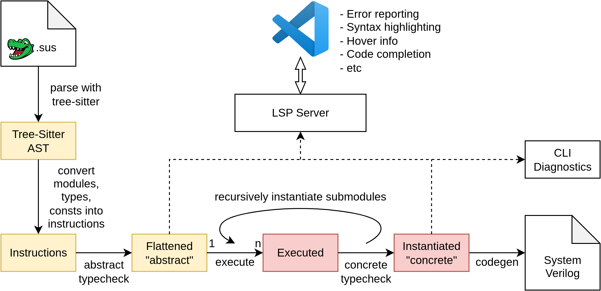

# How SUS code is compiled



There are five major "stages" in the SUS compiler:

## Parsing

Parsing is done using [tree-sitter](https://tree-sitter.github.io/tree-sitter/). Tree-Sitter was chosen due to its fast parse times and error tolerance. It generates an untyped syntax tree, with `ERROR` nodes representing invalid syntax. These error nodes are converted to diagnostics to let the programmer know what's up. 

## Flattening

The untyped syntax tree is then converted to a "flattened" variant. This is basically a sequence of instructions for compile-time execution. This list of instructions is still untuy

In this example, we'll look at a `ToOneHot` module, shown below. 

```sus
module ToOneHot#(int SIZE) {
  input int#(FROM: 0, TO: SIZE) idx
  output bool[SIZE] bits
  
  for int i in 0..5 {
    bits[i] = idx == i
  }
}
```

During parsing and flattening, the above module is turned into a sequence of instructions. Something roughly like:
```
$0: Declaration("SIZE", GenerativeParameter, "int", ...)
$2: Expression(IntConstant(0, ...))
$1: Expression(VarRead("SIZE", ...))
$3: Declaration("idx", Wire, "int#(FROM: $1, TO: $2)", ...)
$4: Expression(VarRead("SIZE", ...))
$5: Expression(IntConstant(0, ...))
$6: Expression(IntConstant(5, ...))
$7: Declaration("i", Generative, "int", ...)
$8: ForLoop(in: $7, from: $7, to: $8, body: $9-$13)
$9: Expression(VarRead("i", ...))
$10: Expression(VarRead("idx", ...))
$11: Expression(VarRead("i", ...))
$12: Expression(Operator($10, "==", $11, ...))
$13: Assign("bits[$9]", $12, ...)
```

## Abstract Typechecking
All declared modules, structs, consts go through the *abstract* typing stage exactly once. During abstract typechecking stage, global names are resolved, module ports and struct fields are resolved, it is checked that rumtime values aren't passed to compiletime contexts, clock domains are assigned and checked for conflicts, and light typechecking (ensures `int` is not passed to a function requiring a `bool` for instance, but bounds aren't checked yet). Its main task is to catch all errors that can be caught, before concrete values are known for the object's [Parameters](../docs/module_parameters.md). 

In the `ToOneHot` module, the compiler finds no abstract typing errors, so we it is now ready for execution. 

## Execution
After the `ToOneHot` has been abstract-typechecked, it may be instantiated with some concrete arguments. In this case we chose `ToOneHot#(SIZE: 5)`. The SUS compiler acts much like a simple imperative interpreter. Using loops and `if` statements as control flow, altering compile-time variables as written. When `when` statements, or other runtime statements like assigns and submodule instantiations are encountered, they are converted to wires/submodules to be included in the final design. Importantly, the types of these wires & submodules does not have to be fully known at execution time. Full resolution of these types and the instantiation of submodules only happens during Concrete Typechecking. 

After executing all the compile-time code, we are left with a module that effectively looks like:
```sus
module ToOneHot_SIZE_5 {
  input int#(FROM: 0, TO: 5) idx
  output bool[5] bits
  
  bits[0] = idx == 0
  bits[1] = idx == 1
  bits[2] = idx == 2
  bits[3] = idx == 3
  bits[4] = idx == 4
}
```


During execution, errors may crop up, such as array index out of bounds errors, divide by zero, etc. These immediately halt execution. 

**Note: Since you can execute arbitrary code at compiletime, compilation may take arbitrarily long or even hang forever if an infinite loop is created.**

## Concrete Typechecking
If after execution no errors came up, the instantiated module proceeds to the final stage. Here, any concrete values that cannot be generically checked from the abstract representation are checked or inferred. The bounds of integers, array sizes, and parameters of submodules are checked or inferred. When all of a submodule's parameters become known, it is instantiated recursively. 

Let's say we've got another module:
```sus
module OneHotPlusOne {
  input int#(FROM: 0, TO: 4) idx
  output bool[] bits
  
  int idx_plus_one = idx + 1
  
  ToOneHot toh
  
  toh.idx = idx_plus_one
  bits = toh.bits
}
```

The bounds of `idx_plus_one` are inferred: 
```sus
module OneHotPlusOne {
  input int#(FROM: 0, TO: 4) idx
  output bool[] bits
  
  int#(FROM: 1, TO: 5) idx_plus_one = idx + 1
  
  ToOneHot toh
  
  toh.idx = idx_plus_one
  bits = toh.bits
}
```

From this, the `SIZE` parameter of `toh` is inferred:
```sus
module OneHotPlusOne {
  input int#(FROM: 0, TO: 4) idx
  output bool[] bits
  
  int#(FROM: 1, TO: 5) idx_plus_one = idx + 1    // *
  
  ToOneHot#(SIZE: 5) toh
  
  toh.idx = idx_plus_one
  bits = toh.bits
}
```

`ToOneHot#(SIZE: 5)` is instantiated as `ToOneHot_SIZE_5`, and since its output port `output bool[5] bits` has a known size, we infer that our `bits` output should also have size 5:
```sus
module OneHotPlusOne {
  input int#(FROM: 0, TO: 4) idx
  output bool[5] bits                            // *
  
  int#(FROM: 1, TO: 5) idx_plus_one = idx + 1
  
  ToOneHot_SIZE_5 toh                            // *
  
  toh.idx = idx_plus_one
  bits = toh.bits
}
```

Finally, although we didn't cover it in this section, [Latency Counting](latency_counting.md) occurs here too.
