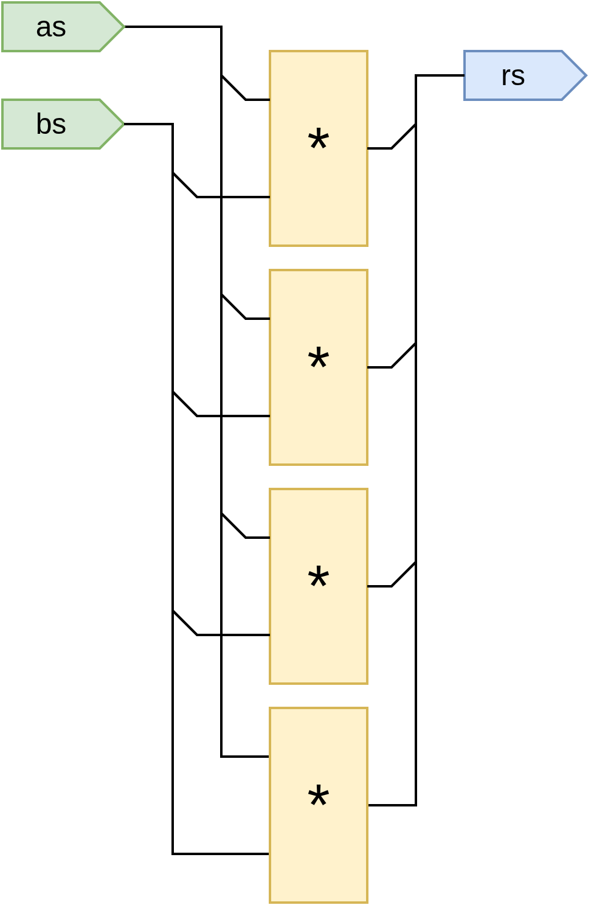
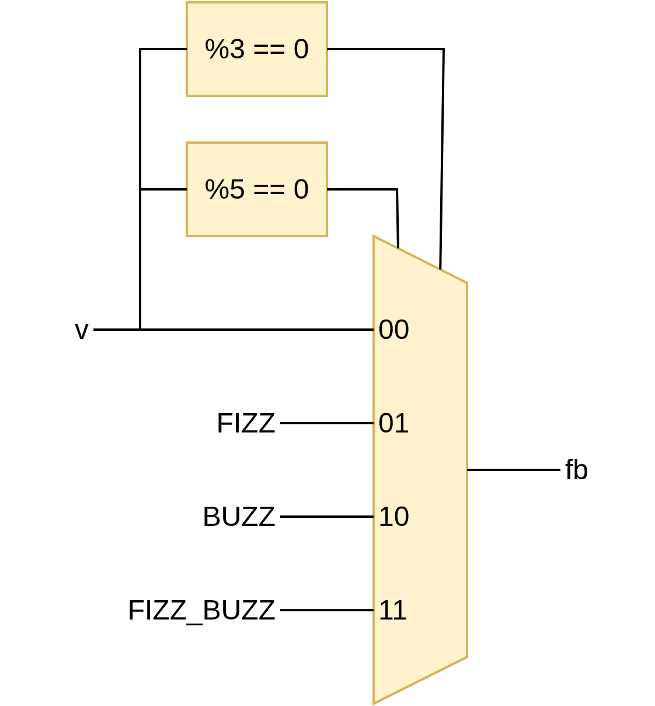
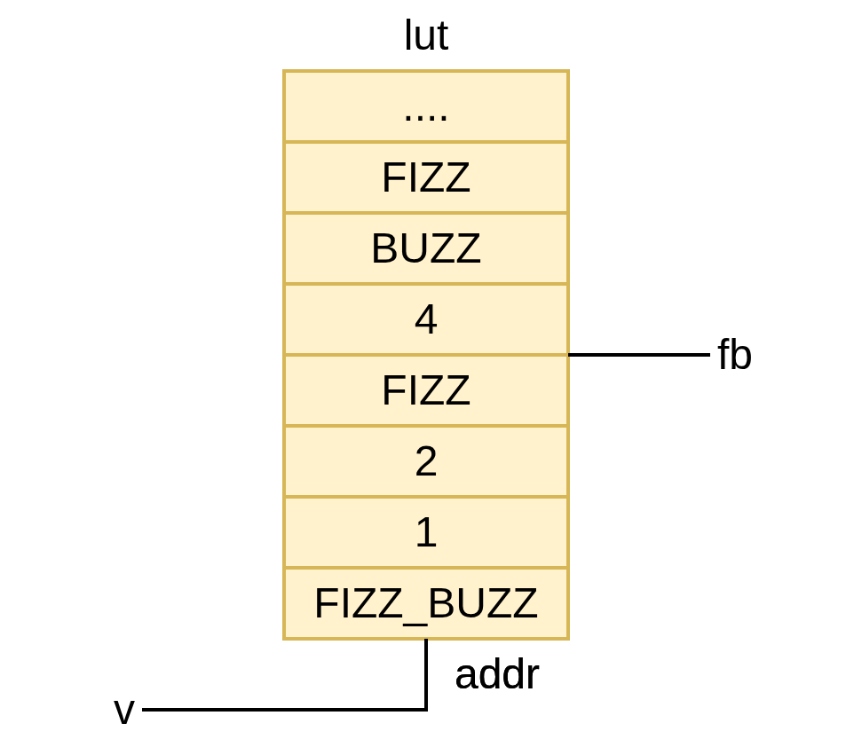

# Compile-Time Code

To make metaprogramming easier, SUS comes with some control flow constructs that make building repetitive structures easier. 

The way it works is that when a module is *instantiated* (IE, concrete values for its parameters are known), the statements in the module body are executed one by one. Control flow constructs like `if`, `for` and `while` affect the control flow during instantiation, but are no longer present in the generated hardware. When execution passes over compile-time (called "generative" (`gen`) code), it updates the current state. This usually is setting the variable of a `gen` variable. When a non-generative statement is executed, the compiler instead instantiates the wire, register, or submodule. For more information see [How SUS is compiled](compiler/how_sus_is_compiled.md). 

## `if`
(For the comparison to the runtime equivalent `when`, see [Conditionals](conditionals.md)).

When executing an `if` statement, the compiler checks if the (compile-time) condition is `true`. If so, the contents of the `if` statement are included in the resulting hardware. If `false`, they aren't. 

As an example, let's say we want to implement a shift register. For small depths, we would instantiate several registers back to back. But if the the depth becomes larger, the cost of all those registers would make us want to use a memory block instead.
```sus
module ShiftReg#(T, int DEPTH) {
    input T din
	output T dout
    
    if DEPTH <= 3 {
        // Not worth it to use the memory block. A few registers back to back will do. 
		state T[DEPTH] regs
		regs[0] = din
		for int I in 1..DEPTH {
			regs[I] = regs[I - 1]
		}
		dout = regs[DEPTH - 1]
    } else {
		// Create a memory block, with a rotating index
        state T[DEPTH] mem
        state int#(FROM: 0, TO: DEPTH) cur_idx
        initial cur_idx = 0
        cur_idx = cur_idx + 1 mod DEPTH

        dout = mem[cur_idx]
    }
}
```

## `for`
For loops express repeated structures. As the loop iterates, it repeatedly executes the body with incrementing index values, starting at the lower bound, and incrementing by one until reaching the upper bound. Note that the lower bound is the first index in the iteration, whereas the last index in the iteration is `upper_bound - 1`. Inclusive lower bound, exclusive upper bound. As of the time of writing, for loops do not support step size other than '1'. 

```sus
module Sums {
    input int#(FROM: 0, TO: 16)[4] as
    input int#(FROM: 0, TO: 16)[4] bs
	output int[10] rs

	for int I in 0..4 {
		rs[I] = as[I] + bs[I]
	}
	/*
	The above loop is equivalent to writing:
	rs[0] = as[0] + bs[0]
	rs[1] = as[1] + bs[1]
	rs[2] = as[2] + bs[2]
	rs[3] = as[3] + bs[3]
	*/
}
```


## `while`
**Not yet implemented.**

## Larger example
As an example, say we wish to implement the typical [Fizz Buzz](https://en.wikipedia.org/wiki/Fizz_buzz) interview question problem. We are given a number, if it's divisible by 3, output "fizz", when divisible by 5 "buzz", and "fizzbuzz" when divisible by both. Otherwise, the input number itself should be returned. We can do a direct implementation of it as shown below:
```sus
module fizz_buzz {
    input int#(FROM: 0, TO: 1000) v
    output int fb
    
    gen int FIZZ = 888
	gen int BUZZ = 555
	gen int FIZZ_BUZZ = 888555

	bool is_fizz = v mod 3 == 0
	bool is_buzz = v mod 5 == 0

	when is_fizz & is_buzz {
		fb = FIZZ_BUZZ
	} else when is_fizz {
		fb = FIZZ
	} else when is_buzz {
		fb = BUZZ
	} else {
		fb = v
	}
}
```


Although this would be an adequate solution for hardware simulation, divide and modulo blocks are rarely synthesizeable. For those, we may want to reach for a precomputed lookup table instead. Indeed, we can declare the lookup table as a compile-time array, and fill it out with all possible inputs we might encounter with a for loop. Note that since this is compiletime, the `when` blocks from before have turned into `if` statements. 

```sus
module fizz_buzz_gen {
	gen int TABLE_SIZE = 1000
    input int#(FROM: 0, TO: TABLE_SIZE) v
    output int fb

	gen int FIZZ = 888
	gen int BUZZ = 555
	gen int FIZZ_BUZZ = 888555

	gen int[TABLE_SIZE] LUT

	for int I in 0..TABLE_SIZE {
		gen bool IS_FIZZ = I mod 3 == 0
		gen bool IS_BUZZ = I mod 5 == 0

		if IS_FIZZ & IS_BUZZ {
			LUT[I] = FIZZ_BUZZ
		} else if IS_FIZZ {
			LUT[I] = FIZZ
		} else if IS_BUZZ {
			LUT[I] = BUZZ
		} else {
			LUT[I] = I
		}
	}

    // The only line that actually generates hardware
	fb = LUT[v]
}
```

