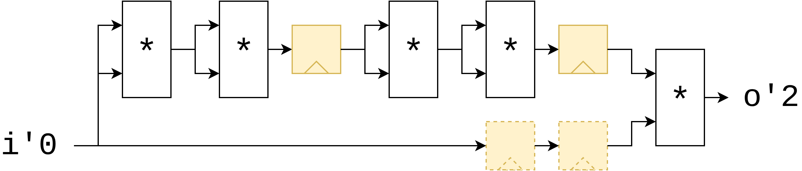
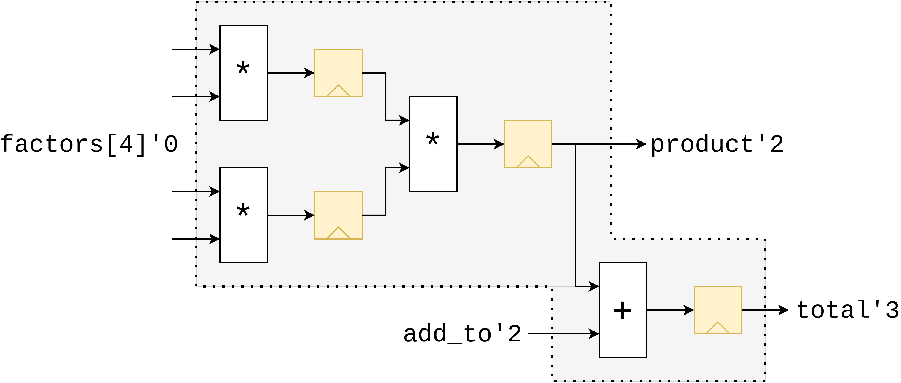

# Latency Counting

If there's one thing the name "SUS" is synonimous with, it's Latency Counting. Latency Counting is the algorithm that makes it easy to add pipeline stages anywhere in a hardware design, automatically adjusts the pipelining of the signals around it, and even lets the various latency-sensitive modules in your design react to the change in latency. 

A short video on how Latency Counting is used is here: ![Latency Counting in the SUS Compiler [LATTE24]](https://youtu.be/7P0BvXSHLpY)

## Theory
Inserting latency registers on every path that requires them is an incredibly tedious job. Especicially if one has many signals that have to be kept in sync for every latency register added. This is why I propose a terse pipelining notation. Simply add the `reg` keyword to any critical path and any paths running parallel to it will get latency added to compensate. This is accomplished by adding a 'latency' field to every path. Starting from an arbitrary starting point, all locals connected to it can then get an 'absolute' latency value, where locals dependent on multiple paths take the maximum latency of their source paths. From this we can then recompute the path latencies to be exact latencies, and add the necessary registers. 

## Automatic pipeline balancing
Imagine we wish to pipeline a "raise to the 17th power" module. We can implement this computation by multiplying `i` by itself 4 times, and then multiplying that by the original `i` once more. Now, because the critical path in this module is be quite long, we decide to add a few pipeline stages between the multipliers using the `reg` keyword, such that our critical path only ever includes two multipliers instead of 5. Latency Counting will then ensure that the parallel path (the original `i` copy), is delayed by the same amount by adding two registers on that path too.
```sus
module pow17 {
    input int#(FROM: 0, TO: 10) i
    output int o

	    int i2  = i * i
	reg int i4  = i2 * i2
	    int i8  = i4 * i4
	reg int i16 = i8 * i8
	        o   = i16 * i
}
```


## Inference of latencies on ports
Some languages that support pipelining constructs similar to this have the restriction that all inputs must be provided at the same time, and all outputs are produced at the same time, some number of clock cycles later. SUS does not have this restriction. The ports in a module will be assigned absolute latencies such that the inputs come in as late as possible, and the outputs are produced as early as possible, thereby packing the module together as compactly as possible. Using a module with such skewed port latencies may seem daunting and error-prone at first, but you'll notice that where this module is instantiated, the compiler will automatically adjust for its port latencies so you as the user don't have to worry about it. 
```sus
module wonky_port_latencies {
    input int#(FROM: 0, TO: 16)[4] factors
	input int#(FROM: 0, TO: 16) add_to
    input int#(FROM: 0, TO: 16) product 
    output int total

	reg int mul0 = factors[0] * factors[1]
	reg int mul1 = factors[2] * factors[3]

	reg product = mul0 * mul1
	reg total = product + add_to
}
```


## Latency Specifiers
The way Latency Counting actually works is by assigning an integer value to each wire in your design - the so-called "Absolute Latency" - which denotes how much this wire is delayed compared to an arbitrarily chosen starting point. The programmer can explicitly specify these absolute latencies by adding `'N` annotations to the wire's declarations. This can cause the compiler to have to insert extra registers. 

```sus
module module_taking_time {
	input bool i'0
	output bool o'5
	o = i
}
```


Specifying latencies on ports is also the gateway to using [Latency Inference](latency_inference.md). 

## Solution Uniqueness
A promise of SUS is that it's still an RTL language.
This means that the code you write should have exactly one well-specified realization as a netlist.
Remember the basic rules of Latency Counting:

<center><b>Rule 1: <code>reg</code> and submodules require a minimum latency between their endpoints, but adding latency more registers is always allowed</b></center>

<center><b>Rule 2: Latency Registers must be inserted to delay faster paths, to stay in sync with slower parallel paths</b></center>

These two rules still allow for an infinite number of valid solutions. (Simply push inputs backward and outputs forward.) To counteract this freedom, we can add the requirement: "inputs must be taken as late as possible, outputs must be provided as early as possible". This seems promising, but what "late" and "early" precisely mean is still a little vague. We can make it more concrete by reformulating it as:

<center><b>Rule 3: The latency distance between any pair of strongly connected input/output ports is minimal</b></center>

With this requirement, the vast space of possible latency assignments is already mostly constrained, though we still have a little wiggle-room in where exactly we insert Latency Registers for balancing according to Rule 2. Finally, we constrain these too with:

<center><b>Rule 4: If a wire is in the fanout of an input port, it must be pushed as early as possible. If it is not in the fanout of an input, but it <i>is</i> in the fanin of an output, then it must be pushed as late as possible.</b></center>

Rule 4 did quite conspicuously leave out what to do with wires that are neither in the fanout of an input wire, nor in the fanin of an output wire. Sadly, I've not yet found a good rule to constrain such wires. Luckily it turns out that wires that are neither connected to an input, nor to an output have little practical use. Since they do not interfere with the important downstream benefits of Solution Uniqueness, it is seen as acceptable to simply leave their absolute latencies up to the implementation details of Latency Counting. 

**Note: It is allowed to shift all absolute latencies upwards or downwards by a fixed offset, since this does not change any of the differences between the ports. We only consider uniqueness of the absolute latencies up to a constant offset.**

### The benefits of Uniqueness
- The interface of a module is always deterministic. Module ports are **always** at a minimal distance from one another. If the compiler notices that the choice is not deterministic, it will throw an [No Unique Port Latencies Error](resolving_errors.md#no-unique-port-latencies). 
- The [Interence of Submodule Parameters](../inference.md) is fully deterministic. 
- The placement of latency registers in wires that are in the fanin of output ports, and the fanout of input ports is intuitive and predictable, even if sometimes a little surprising. 
