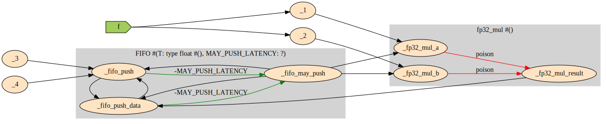
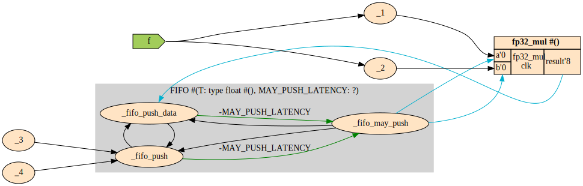
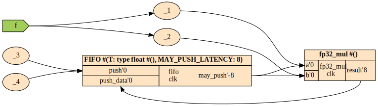
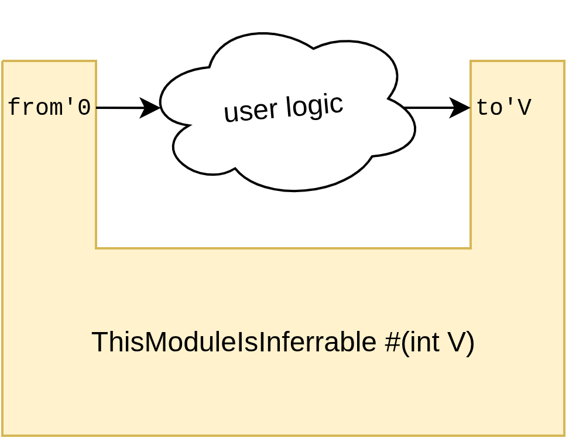

# Latency Inference

Besides computing the absolute latencies of all wires in a module based on the absolute latencies of all of its submodules ("Latency Counting"), it is also possible to infer the parameters of your submodules based on the latencies present on their ports, which we term "Latency Inference". For this, one or more parameters of your *Latency Sensitive* module must be inferrable. 

Latency Inference starts at the declaration of your module. You must attach absolute latency annotations to at least an input and an output port of your module, and the difference between those absolute latencies must be linear in exactly one [integer parameter of this module](../module_parameters.md). Since this is a bit of a mouthful, let's look for example at [FIFO](https://sus-lang.org/std/memory.html#FIFO):

```sus
module FIFO #(T, int DEPTH, int MAY_PUSH_LATENCY) {
    domain push_dom
        output bool may_push'-MAY_PUSH_LATENCY
        action push'0 : T push_data'0
    domain pop_dom
        output bool may_pop'0
        action pop'0 : -> T pop_data'1
}
```

<svg xmlns="http://www.w3.org/2000/svg" width="420" height="220" font-family="'Fira Code',monospace" font-size="11">
<defs><marker id="ah-green" markerWidth="5" markerHeight="5" refX="0" refY="2.5" orient="auto"><path d="M 5,0 L 0,2.5 L 5,5 Z" fill="#22a85a"/></marker><marker id="ah-red" markerWidth="5" markerHeight="5" refX="5" refY="2.5" orient="auto"><path d="M 0,0 L 5,2.5 L 0,5 Z" fill="#e53e3e"/></marker></defs>
<text x="210" y="28" text-anchor="middle" font-size="13" font-weight="bold" fill="#1a1227">FIFO</text>
<rect x="140" y="36" width="140" height="172" fill="#f7f6fb" stroke="#c0b8d4" stroke-width="1.5" rx="2"/>
<line x1="140" y1="85" x2="280" y2="85" stroke="#c0b8d4" stroke-width="1"/>
<line x1="140" y1="146" x2="280" y2="146" stroke="#c0b8d4" stroke-width="1"/>
<text x="276" y="80" text-anchor="end" fill="#9b96aa" font-size="10">clk</text>
<text x="144" y="50" fill="#5a5370" font-size="10">clock clk</text>
<text x="276" y="141" text-anchor="end" fill="#9b96aa" font-size="10">push_dom</text>
<text x="276" y="203" text-anchor="end" fill="#9b96aa" font-size="10">pop_dom</text>
<path d="M 140,127 C 210,127 210,105 280,105" stroke="#22a85a" fill="none" stroke-width="1.2" opacity="0.8" marker-start="url(#ah-green)"/>
<text x="210" y="113" text-anchor="middle" font-size="10" fill="#22a85a">MAY_PUSH_LATENCY</text>
<path d="M 140,105 C 210,105 210,105 280,105" stroke="#22a85a" fill="none" stroke-width="1.2" opacity="0.8" marker-start="url(#ah-green)"/>
<text x="210" y="102" text-anchor="middle" font-size="10" fill="#22a85a">MAY_PUSH_LATENCY</text>
<line x1="112" y1="66" x2="140" y2="66" stroke="#555" stroke-width="1.5"/>
<text x="108" y="66" text-anchor="end" dominant-baseline="middle" fill="#1a1227">rst</text>
<line x1="112" y1="105" x2="140" y2="105" stroke="#555" stroke-width="1.5"/>
<text x="108" y="105" text-anchor="end" dominant-baseline="middle" fill="#1a1227">push</text>
<line x1="112" y1="127" x2="140" y2="127" stroke="#555" stroke-width="1.5"/>
<text x="108" y="127" text-anchor="end" dominant-baseline="middle" fill="#1a1227">push_data</text>
<line x1="280" y1="105" x2="308" y2="105" stroke="#555" stroke-width="1.5"/>
<text x="312" y="105" dominant-baseline="middle" fill="#1a1227">may_push</text>
<line x1="112" y1="162" x2="140" y2="162" stroke="#555" stroke-width="1.5"/>
<text x="108" y="162" text-anchor="end" dominant-baseline="middle" fill="#1a1227">pop</text>
<line x1="280" y1="162" x2="308" y2="162" stroke="#555" stroke-width="1.5"/>
<text x="312" y="162" dominant-baseline="middle" fill="#1a1227">may_pop</text>
<line x1="280" y1="189" x2="308" y2="189" stroke="#555" stroke-width="1.5"/>
<text x="312" y="189" dominant-baseline="middle" fill="#1a1227">pop_data</text>
</svg>

As can be seen on FIFO's inference diagram. The green lines show that `MAY_PUSH_LATENCY` can be inferred from the paths from `may_push` to `push`, and `may_push` to `push_data`. Now, how precisely is this inference done? 

For a very minimal example of inference, `InferFIFO` instantiates [FIFO](https://sus-lang.org/std/memory.html#FIFO) and a [fp32_mul](https://github.com/pc2/sus-float) operator. 

```sus
module InferFIFO {
    FIFO#(DEPTH: 256) fifo
    
    input float f
    
    when fifo.may_push {
        // fp32_mul has 8 cycles latency
        float f_squared = fp32_mul(f, f)
        fifo.push(f_squared)
    }
}
```

So, in this example, there is a path from `fifo.may_push`, through activating the `fp32_mul`, to `fifo.push_data`. Initially, right after execution the module looks as below. Neither `fifo`, nor `fp32_mul` have been instantiated yet. `fifo` might attempt to do a Latency Inference for `MAY_PUSH_LATENCY` on that path, but since `fp32_mul` hasn't been instantiated yet, and therefore its latency isn't known yet, the inference attempt gets [poisoned](algorithm.md#poisoning). 


After one step of typechecking, the compiler has seen `fp32_mul` has no template parameters and thus instantiates it. From the instantiation, the compiler learns it has a latency of 8 clock cycles. This new information updates the Latency Counting graph, and importantly *removes* the poison edges and replaces them with "Latency 8" edges. 

`fifo` makes a second attempt at Latency Inferring `MAY_PUSH_LATENCY`, and this time, inference succeeds. The search algorithm travels out from `may_push`, through the now known 8 cycle latency of `fp32_mul`, and returns to `push_data` with a measured distance of 8 cycles. From this, `MAY_PUSH_LATENCY=8` is inferred. 



With all of `fifo`'s parameters now known, the compiler can also instantiate it. 



## Designing Latency Sensitive Interfaces

Fundamentally, making a [module parameter](../module_parameters.md) Latency Inferrable isn't difficult. Simply make sure to annotate have at least one `input` port, and one `output` port in the same [domain](domains.md) with Absolute Latencies. If the Absolute Latencies you specified are at an offset linear in that module parameter, then it'll be possible to infer the parameter from those ports[^1]. 

[^1]: Caveat, the compiler is fairly lenient in the kinds of expressions can be in such inferrable annotations, but complex operations, like `pow2`, `clog2`, etc will prevent the compiler from inferring the linearity. It's best to keep such expressions simple. `+`, `-`, `*` all work, but nothing beyond those. 

In its most basic form, a *Latency Sensitive* module looks like this:
```sus
module ThisModuleIsInferrable #(int V) {
    output bool from'0
    input bool to'V
}
```



When some cloud of user logic is attached between the `output from` and `input to`, that has some number of pipeline stages. Let's say the user logic has 5 pipeline stages, then any value of `V < 5` would cause a [Net Positive Latency Cycle Error](resolving_errors.md#net-positive-latency-cycle). Since there is only one place that can infer `V`, it will in fact be inferred to `V=5`. However, in the case there are [multiple places in the module where the parameter can be inferred](../inference.md#multiple-inference-candidates). In that case, perhaps a value higher than 5 might be chosen, if another constraint requires it. 

### Tip: Specify All Port Latencies for latency-sensitive modules. 
For latency-sensitive modules, it is best to attach explicit latencies to *all* their ports, and to try to make these latencies as simple as possible. Any pair of ports between which the latency isn't known to be a constant from the annotations (such as `'3` -> `'7`), or is inferrable (`-V` -> `3`) [^2], will be seen as a [Poison edge](algorithm.md#poisoning). 

[^2]: which will not affect other inference attempts, since the assumption is that `V` will be inferred such as not to affect the surrounding pipeline. 

For non-latency-sensitive modules usually don't need to have their port latencies specified explicitly, since they likely will be instantiated early, in which case exact latencies are known. 

### Tip: Be agressive in splitting latency-sensitive modules into separate domains [Domain](domains.md)
Really, making latency sensitive modules is just an exercise in *avoiding any and all Poison Edges*. By splitting unrelated interfaces of the module into separate domains, no poison edges can be formed across the domain boundary. For an example of this, see [FIFO](https://sus-lang.org/std/memory.html#FIFO). 
