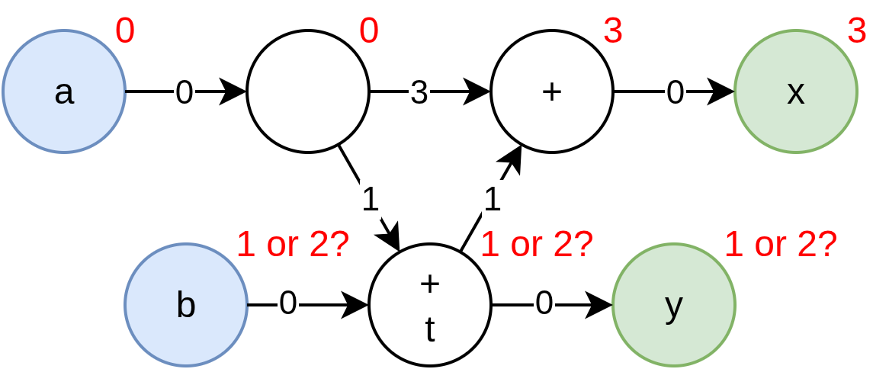

# Resolving Latency Counting Errors
When working with the Latency Counting system, errors may crop up that may at first seem rather cryptic. Usually they stem from Latency Counting's rather stringent [Solution Uniqueness](latency_counting.md#solution-uniqueness) requirement, and are therefore fairly trivial to resolve. Still, this article covers what causes each Latency Counting Error and provides strategies to resolve it. 

## Net Positive Latency Cycle
This is perhaps the most straight-forward of them all. You've created a loop in the pipeline, which makes it impossible to assign absolute latencies to your wires without violating the latency requirement of one of your submodules, or ignoring one of your `reg` requirements. 

### Example 1
```sus
module Accumulator {
    state float cur_total

    action accumulate : float value -> float total {
        // Latency of +11
        total = cur_total
        cur_total = fp32_add(cur_total, value)
    }

    action rst {
        cur_total = 0.0
    }
}
```

In this example, we wish to accumulate floating point values as they come in, but we forgot to account for the 11 cycles of latency [fp32_add](https://github.com/pc2/sus-float) takes. The compiler rightfully complains that there isn't enough time to compute the sum before it is required for the next addition. 

#### Resolution 1: Use a better primitive
If it is available we can use a more appropriate primitive [fp32_acc](https://github.com/pc2/sus-float) which does support single-cycle accumulation.

```sus
module Accumulator {
    fp32_acc accumulator

    action accumulate : float value -> float total {
        // Latency of +11
        total = accumulator.acc(value)
    }

    action rst {
        accumulator.rst()
    }
}
```

#### Resolution 2: Slow down the input stream
If our platform doesn't support `fp32_acc`, or our operation is so complicated that it cannot be reduced to a single clock cycle without degrading our clock frequency, we must find some other alternative.

If it turns out that this part of the computation isn't critical for the speed of our design, we can consider by lowering the "Initiation Interval" using [SlowState](https://sus-lang.org/std/control_flow.html#SlowState), [SlowPipelineBegin](https://sus-lang.org/std/control_flow.html#SlowPipelineBegin) or [SlowPipelineEnd](https://sus-lang.org/std/control_flow.html#SlowPipelineEnd). 

```sus
module Accumulator {
    SlowState#(T: type float, RESET_TO: 0.0) cur_total

    trigger may_accumulate
    action accumulate : float value -> float total {
        float next_sum = fp32_add(cur_total.old, value) // Takes 11 cycles
        cur_total.update(next_sum)
        total = next_sum
    }

    when cur_total.may_update {
        may_accumulate()
    }

    action rst {
        cur_total.rst()
    }
}
```

#### Resolution 3: Multiplex multiple parallel executions
Perhaps we don't just want to accumulate one stream of values, but we actually want to accumulate many different streams of values. We can multiplex these different streams together, using only a single instance of the feedback loop. With this, the iteration time of a single stream is not improved, but we're still using all the throughput this pipeline can provide. 

```sus
module Accumulator {
    // Choose 16 because it's a nice power of 2 above the 11 cycles of fp_add latency
    gen int NUM_PARALLEL_ACCUMULATORS = 16
    RAM#(T: type float, DEPTH: NUM_PARALLEL_ACCUMULATORS) cur_totals

    trigger may_accumulate
    action accumulate : float value, int#(FROM: 0, TO: NUM_PARALLEL_ACCUMULATORS) stream_id -> float total {
        float cur_total = cur_totals.read(stream_id)
        float next_sum = fp32_add(cur_total, value) // Takes 11 cycles
        cur_totals.write(stream_id, next_sum)
        total = next_sum
    }

    action rst {
        cur_total.rst()
    }
}
```

With this approach, we must make sure that the input does not touch the same `stream_id` twice within 13 cycles. (2 extra for the RAM). 

For more other problems like iterative algoritms, you may be interested in [ParallelWhile](https://sus-lang.org/std/control_flow.html#ParallelWhile) instead.

### Example 2
```sus
module SetReset {
    input bool set_true
    input bool set_false

    output state bool x = false

    when !x & set_true {
        reg x = true // <<<=== Incorrectly added `reg` here. 
    }
    when x & set_false {
        x = false
    }
}
```
In this example, there is a subtle dependency between reading `x` in the condition, and setting `x` to `true` with a delay of `1` register. This dependency creates a net positive latency cycle of `+1`. 

#### Resolution
In this case, of course we should remove the register, since a `state` variable already comes with a register. This example was meant to illustrate the subtle dependencies that can arise from the conditions on our `when` blocks. 

## Conflicting Specified Latencies
Quite similar to the [Net Positive Latency Cycle](#net-positive-latency-cycle), but in this case the difference in the Absolute Latencies you have explicitly assigned to two wires is smaller than the minimum latency the path between them actually takes. 

### Example
```sus
module ConflictingLatencies {
    input bool i'0
    output bool o'1 // <<<=== Conflicting Latency is reported here

	reg bool t = i
	reg o = t
}
```
In the above example, we've added two latency registers, but our explicit annotations setting `i` to absolute latency `0` and `o` to `1` conflicts with this.

#### Resolution
In this case the fix is rather easy, either reduce the amount of latency within the module, or adjust (or even remove) the absolute latency annotations. 

## Not Strongly Connected Ports
The first step in Latency Counting is always to figure out the absolute latencies of the ports. SUS' Latency Counting does this by performing graph traversals from every port, and finding the minimum distance the other ports that are connected to it. If there's no path between two ports, then the Latency Counting system cannot assign them a relative latency. 

### Example 1
```sus
module UnconnectedPort {
    input bool i
    output bool a
    output bool b // <<<=== Not connected to i

	reg a = i
    b = true
}
```

#### Resolution
If we want to maintain a conceptual link between `b` and `a` values, despite in this case `b` being effectively constant, we should use explicit absolute latencies to pin them together:
```sus
module UnconnectedPort {
    input bool i
    output bool a'0
    output bool b'0

	reg a = i
    b = true
}
```

However, if `b` is conceptually not directly linked to any one specific `a` value, instead you should consider putting `b` into a separate [domain](domains.md) from `a` and `i`. By using separate domains for them, we make it clear on the interface that they are independent. 
```
module UnconnectedPort {
    domain a_dom
    input bool i
    output bool a

    domain b_dom
    output bool b

	reg a = i
    b = true
}
```

### Example 2
```sus
module OnlyOutputs {
    output state int minute
    output state int hour

    initial minute = 0
    initial hour = 0

    when minute == 59 {
        hour = hour + 1 mod 24
    }
    minute = minute + 1 mod 60
}
```

In this example, there is logic connecting the `hour` and `minute` ports, but the compiler still complains. That is because there's no shared `input` port to measure the distances of `hour` and `minute` off of. In theory the compiler would be allowed to place these ports at an arbitrary offset from one another, and insert however many registers it wants. 

#### Resolution
As with the previous example, the solution is to explicitly assign absolute latency values to `minute` and `hour`:
```sus
module OnlyOutputs {
    output state int minute'0
    output state int hour'0

    initial minute = 0
    initial hour = 0

    when minute == 59 {
        hour = hour + 1 mod 24
    }
    minute = minute + 1 mod 60
}
```

In this case, you might naturally say "Well clearly they should be at the same absolute latency", but in the general case it may not be unique. Extending the cases where Latency Counting can automatically make reasonable choices for such latencies is subject to ongoing research. 

## No Unique Port Latencies
This error comes back to the [uniqueness](latency_counting.md#solution-uniqueness) issue. While the compiler could assign *a* set of absolute latencies to the ports, it notices that it is not the only possibility. That is because it cannot make the distances between all ports minimal *at the same time*. 

### Example
```sus
module ConfusingPorts {
    input bool a
    input bool b
    output bool x
    output bool y // <<<=== The error is reported on one of the ports

	reg bool a_d = a
	bool t = a_d + b
    reg reg reg bool a_dd = a
	reg bool t_d = t
    x = t_d + a_dd
    y = t
}
```



Have a look at the example above. Let's say an arbitrary absolute latency starting point of `a'0` is chosen, then because the distance from it to `x` and `y` must be minimized, hence forcing `x'3` and `y'1`. Counting back from `x` then would require `b'2`, but counting back from `y` would require `b'1`. If instead we chose to start at `b'0`, we would get a similar set of conflicts, requiring `a'-2` from `x'1`, and `a'-1` from `y'0`. 

We cannot make a unique assignment of the absolute latencies for the ports, so we must request input from the programmer. 

#### Resolution
Note that removing any of the ports resolves the issue. Removing `b` results in `a'0`, `x'3`, `y'1`, removing `y` gives `a'0`, `x'3`, `b'2`, etc. 

Since straight-up removing ports is likely not an option for you, instead you can resolve the conflict by manually marking some ports with absolute latencies, such as `a'0`, `b'1` resolves the conflict. 

Luckily, undecidable structures such as we encountered here are rare in real designs. 
