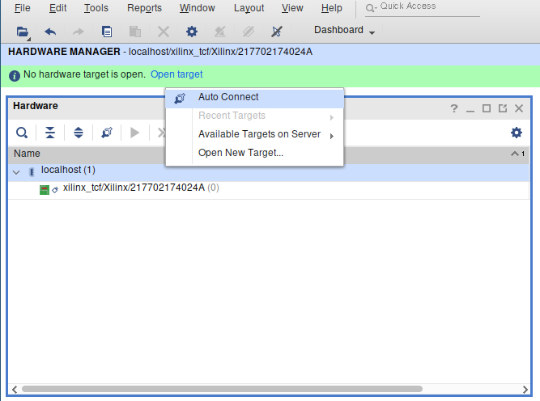
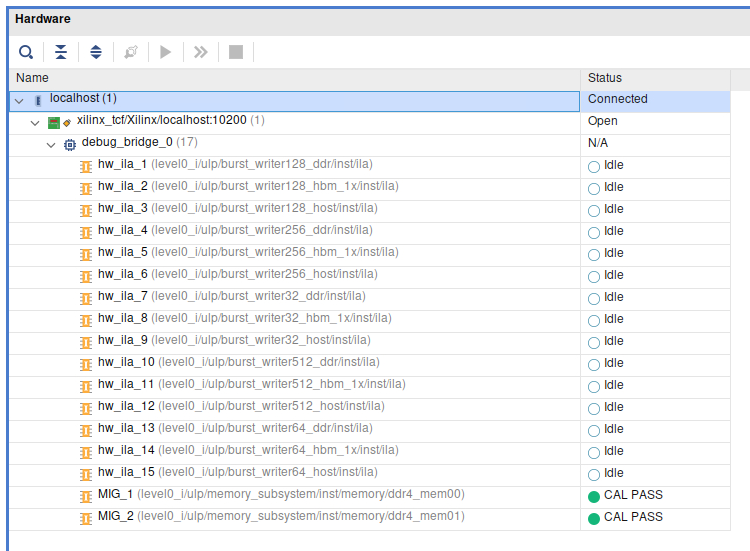
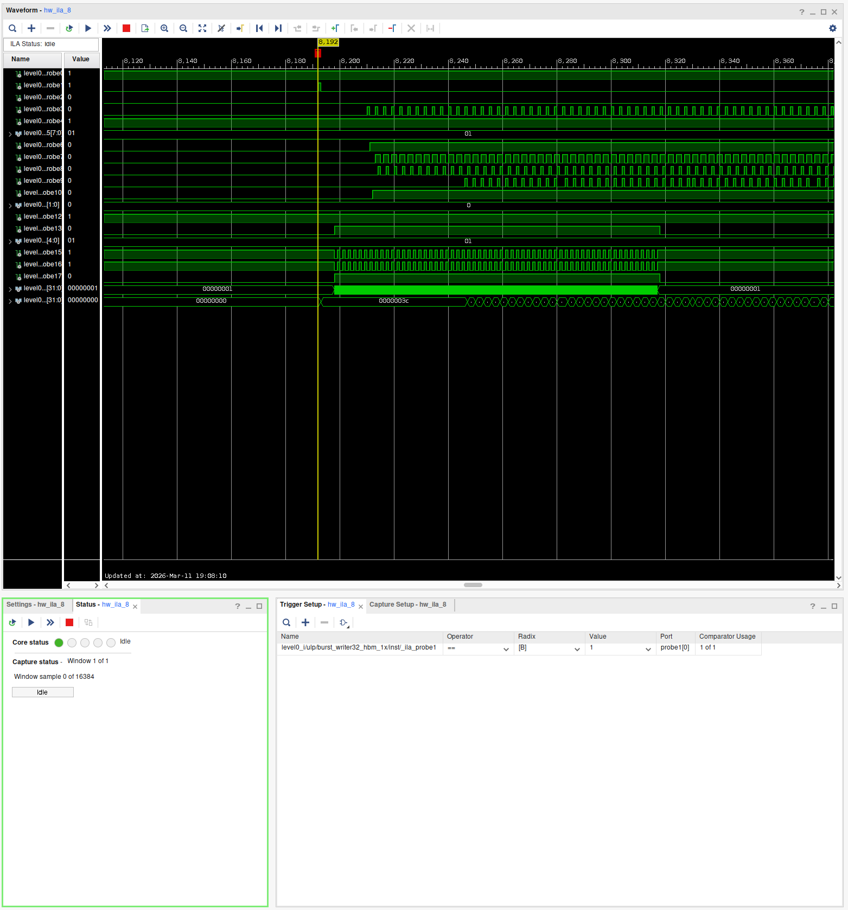
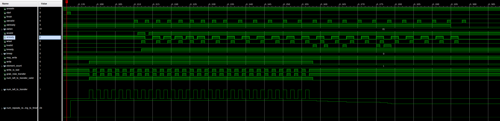

# Using Xilinx' Integrated Logic Analyzer for SUS Designs
If your simulator has failed you, and you're pulling out your hair staring at a failing hardware implementation, your last resort is the [Integrated Logic Analyzer](https://docs.amd.com/api/khub/documents/xKlVO5WOeewsgYv5RWUDUA/content). This is a small IP core that you instantiate into your design, which upon detecting a triggering signal, records all probe signals for 16384 cycles in its in-built BRAM. It only has inputs, and the IP core itself figures out how to connect itself to the JTag interface on the FPGA card. You need only instantiate it and wire it up to your signals. 

**The example in this tutorial is for using it within a SUS kernel in XRT on Noctua 2**

## Overview
### Part 1: Synthesizing a design with an Integrated Logic Analyzer
- Wire up an "extern" ILA module, to all the signals you would like to view. 
- Creating the `ila_crc_counter` IP core in `pack_kernel.tcl`. 
- Synthesize your design. (Your kernel can be instantiated multiple times, Vivado automatically finds the ILA cores and connects them to it's debugging system)

### Part 2: Running your design and viewing the recorded ILA data
- Open VNC on one of the FPGA nodes
- Add a way to "pause" your host code after the bitstream loads (and before any kernel invocation you may want to inspect)
- In VNC: Run your host code until it hits the pause block
- In VNC: Start the Vivado Logic Analyzer
- In VNC: Using the Logic Analyzer

## Part 1: Synthesizing
### Wire up an "extern" ILA module, to all the signals you would like to view. 
In my case, I wanted to debug the AXI4 interface to memory for the Bursting Memory Writer. 

Start by creating an `extern module` for the ILA. In the next section we will instantiate the ILA IP core, but for now we'll declare it's interface, with all the probes we would want to view. They must be named `probeN` in ascending order. 
(You can specify the widths of up to 1024 probes. By default they are 1-bit wide.)
```sus
extern module ila_crc_counter{
    domain clk
    input bool probe0'0
    input bool probe1'0
    input bool probe2'0
    input bool probe3'0
    input bool probe4'0
    input int#(FROM: 0, TO: 256) probe5'0
    input bool probe6'0
    input bool probe7'0
    input bool probe8'0
    input bool probe9'0
    input bool probe10'0
    input bool[2] probe11'0
    input bool probe12'0
    input bool probe13'0
    input int#(FROM: 0, TO: 32) probe14'0
    input bool probe15'0
    input bool probe16'0
    input bool probe17'0
    input int#(FROM: 0, TO: pow2#(E: 32)) probe18'0
    input int#(FROM: 0, TO: pow2#(E: 32)) probe19'0
}
```
I put every signal into its own domain, such that no pipelining registers would affect the view of the signals. Perhaps if you're debugging a pipeline, this may be desirable. Adjust to taste. 

**Important: Note that the ports that aren't `bool` correspond to the wider integers**

Once you have the `extern module ila_crc_counter`, instantiate it and wire it up:
```sus
module bench_burst_writer#(int AXI_WIDTH) {
    // ...
    ila_crc_counter ila

    ila.probe0 = aresetn
    ila.probe1 = ila_start
    ila.probe2 = ila_finish

    ila.probe3 = m_axi_awvalid
    ila.probe4 = m_axi_awready
    ila.probe5 = m_axi_awlen

    ila.probe6 = m_axi_wvalid
    ila.probe7 = m_axi_wready
    ila.probe8 = m_axi_wlast

    ila.probe9 = m_axi_bvalid
    ila.probe10 = m_axi_bready
    ila.probe11 = m_axi_bresp

    ila.probe12 = writer.may_write
    ila.probe13 = writer.write
    ila.probe14 = writer.element_count
    ila.probe15 = writer.write_is_last

    ila.probe16 = grab_new_transfer
    ila.probe17 = num_left_to_transfer_valid
    ila.probe18 = num_left_to_transfer
    ila.probe19 = num_repeats_remaining_to_finish
}
```

Important considerations for wiring it up:
You'll want a signal you can trigger the ILA on, as it can only . In this case, I used the `start` wire the `axi_ctrl_slave` produces. 

**Note: There's no need to explicitly specify that a given signal is your trigger right now. The ILA has functionality to be dynamically reconfigured to trigger on a wide range of conditions**

**When choosing what signals to probe, consider carefully. Add any signal you believe might be useful in tracking down your issue, since a synthesis roundtrip can easily take 3 hours.**

### Adding the IP core to `pack_kernel.tcl`
Now that you have the as-of-yet undefined ILA wired up in your SUS design, you can expliticly create it in your `pack_kernel.tcl`:
```
# Existing pack_kernel.tcl code...

set KERNEL_NAME burst_writer${AXI_WIDTH}

create_project ${KERNEL_NAME} ./${KERNEL_NAME} -part $PART

add_files -norecurse \
{
    ../../sus_codegen.sv \
}

# Add these lines:

create_ip \
        -name ila \
        -vendor xilinx.com \
        -library ip \
        -version 6.2 \
        -module_name ila_crc_counter \
        -dir ./ip_creation

set_property -dict [list \
  CONFIG.C_MONITOR_TYPE {Native} \
  CONFIG.C_NUM_OF_PROBES {20} \
  CONFIG.C_PROBE5_WIDTH {8} \
  CONFIG.C_PROBE11_WIDTH {2} \
  CONFIG.C_PROBE14_WIDTH {5} \
  CONFIG.C_PROBE18_WIDTH {32} \
  CONFIG.C_PROBE19_WIDTH {32} \
  CONFIG.C_DATA_DEPTH {16384} \
  CONFIG.C_TRIGOUT_EN {false} \
  CONFIG.C_TRIGIN_EN {false} \
  CONFIG.C_INPUT_PIPE_STAGES {0} \
  CONFIG.C_EN_STRG_QUAL {1} \
  CONFIG.C_ADV_TRIGGER {true} \
  CONFIG.ALL_PROBE_SAME_MU {true} \
] [get_ips ila_crc_counter]

# the rest of pack_kernel.tcl ....
ipx::package_project -root_dir ./${KERNEL_NAME}_ip -vendor pc2 -library sus-designs -taxonomy /UserIP -import_files

```
You can configure `CONFIG.C_DATA_DEPTH` to a reasonable value for how much data you wish to collect in a single run. Note that this times the number of probe bits determines how much BRAM this ILA will synthesize. 

You can specify up to 1024 probes. By default they are 1-bit wide.

For more configuration options, it is recommended to create the "ILA" IP core in Vivado, configure it in GUI, and copy over the generated TCL code from the TCL Console. 

### And synthesize!


This should be your normal way to build your bitstream. For this repository, that would be `make U280/overlay_hw.xclbin`

#### When your flow doesn't generate a .ltx file

The `.ltx` file contains information about your ILAs. Namely the names of the debug probes and their sizes. You need to load in this file to look at the waveforms. 

**You don't need to follow this step if you're using XRT.**

Normally, when you write the bitstream, a `.ltx` file should be generated automatically. If it is not, you can open up your implemented Vivado project, and execute the following TCL command:

`write_debug_probes /path/to/file.ltx`

## Part 2: Analyzing

### Open VNC on one of the FPGA nodes
Use the VNC module on Noctua2:
```
[lennartv@n2fpga16 ~]$ ml tools/vnc/8.10
[lennartv@n2fpga16 ~]$ VNC.sh
```
This will print an SSH command, like the following:
```
#############
ssh -L 5901:/tmp/lennartv.runtimedir/vnc1 n2fpga16
Afterwards connect with your local VNC client to your local port 5901
#############
```
Use this ssh command to connect to the node.
Since you likely don't yet have the fpga or compute nodes in your `.ssh/config`, here's a snippet that should help you:
```
Host noctua2-jump
    HostName fe.noctua2.pc2.uni-paderborn.de
    User lennartv
    RequestTTY force
    IdentityFile ~/.ssh/id_ed25519
    IdentitiesOnly yes

Host n2login1
    HostName n2login1
    User lennartv
    ProxyJump noctua2-jump

Host n2cn* n2gpu* n2fpga*
    HostName %h
    ProxyJump n2login1
    User lennartv
```

### In VNC: Load the Bitstream

You should be on a node with your FPGA. First and foremost, load your program once, such that the bitstream has been loaded onto the FPGA. If you're working with a system such as [tapasco](github.com/esa-tu-darmstadt/tapasco) and you have a `.bit` bitstream file, you can also just flash the bitstream with `tapasco-load-bitstream bitstream.bit`. 

#### In VNC: Optional: Add a way to "pause" your host code after the bitstream loads (and before any kernel invocation you may want to inspect)
```cpp
void debug_pause() {
    std::cout << "Paused, press ENTER to continue..." << std::endl;
    std::cin.ignore(std::numeric_limits<std::streamsize>::max(), '\n');
}

void main() {
    xrt::device device = xrt::device("0000:a1:00.1");
    xrt::xclbin xclbin = xrt::xclbin("overlay_hw.xclbin");
    xrt::uuid xclbin_handle_ptr = xrt::uuid(device.load_xclbin(xclbin));

    debug_pause();

    // start running kernels
}
```
##### In VNC: Run your host code until it hits the pause block
`./main.x`

### In VNC: Open the vivado "Hardware Debugger"

Once the bitstream is on the device open "vivado", and from there open the Hardware Debugger. You'll see the "localhost" hardware server. Simply press "Open Target" then "Auto Connect". 



It should now show all your ILAs. It won't however, show you the probes yet. For this you have to load your `.ltx` file. Find it 

### In VNC: Set up your triggers




You can see the waveforms above, bottom left you see the current status of the selected ILA. Bottom right are the triggers. 

- First add a triger. In this instance I'm triggering on the `ctrl.start` signal. 
- Then, "activate" the ILA on the bottom left.
- Finally, continue execution of your executable. This should trigger the ILA and give you some waveforms.

A detailed documentation on using the hardware manager and setting the triggers can be found here:
https://docs.xilinx.com/r/en-US/ug908-vivado-programming-debugging/Connecting-to-the-Hardware-Target-and-Programming-the-Device?tocId=xP8mrtmlSr~QgWEr5ZpJWA

### Bonus: Can you spot the AXI violation?


# Misc:
- Accelerator must have been active at least once to start the hardware debugger server. 
- You can freely restart the accelerator with the server running & debugger open, 
