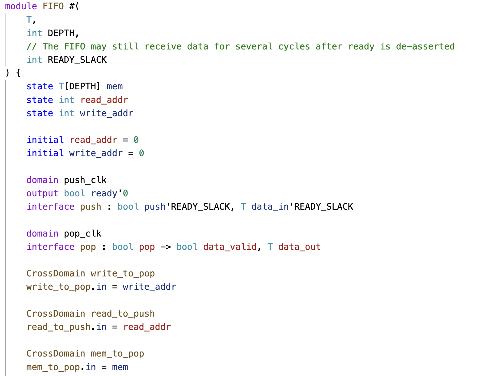
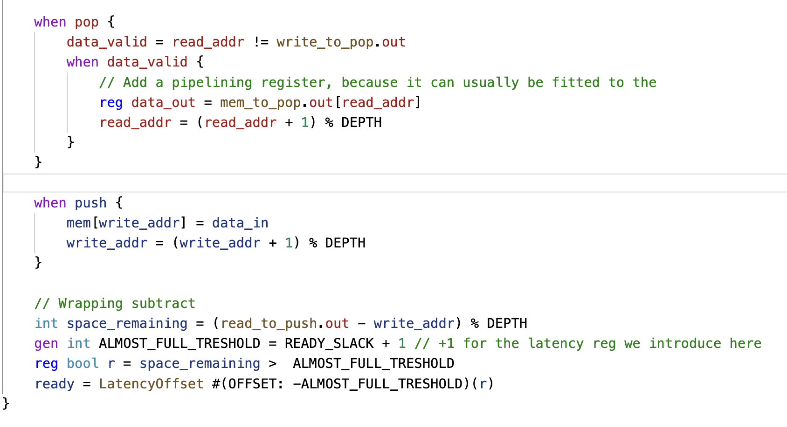

# 1. Dual-Port Memory

The DualPortMem module provides a simple memory with separate read and write clock domains.

Example: A memory block with separate read and write ports, each in its own domain. Every wire belongs to a domain or remains anonymous. Signals can only cross domains via explicit crossing primitives.

# 2. FIFO 

FIFO Memory with Multiple Domains

In this FIFO design, the latency counting idea doesn’t fully apply because the ready signal on the push side doesn’t directly correlate with the request signal on the pop side. The FIFO operates with two domains: a push domain and a pop domain, each with related signals. It allows three cycles of pipelining slack for the input side and takes two cycles to produce data when requested.

To handle domain crossing, explicit constructs are used to ensure correct data transfer between the domains. The FIFO includes registers for read and write addresses across the latency boundary. Additionally, extra latency registers, like for the subtraction and comparison operations, help manage performance.

# 3. Iteration in SUS

The iterator module provides a simple counting loop. It is a state machine for sequential iteration, flexible for various counting ranges. 

## 4. FixedSizeIterator 

FixedSizeIterator module is a simple hardware iterator that counts from 0 to UP_TO - 1, based on a start signal. 

# 5. SlowClockGenerator

 SlowClockGenerator: Generates a slower clock by counting up to a given period.

# 6. SplitAt

 SplitAt: Splits an array into two parts at a specified index.

 

# 7. Abs

Computes the absolute value of an integer.

# 8. Slice

Extracts a sub-array (slice) from a given array.

# 9. BitSelect

Outputs a one-hot encoded signal based on a selected index.

