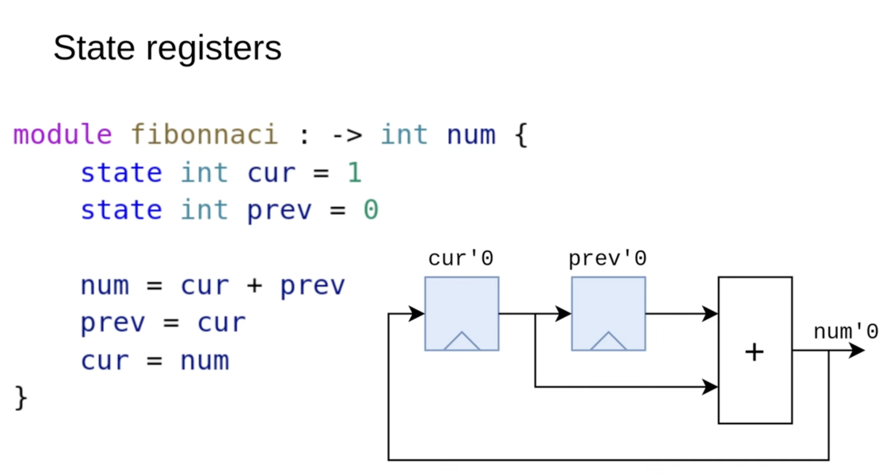

# Registers

In Sus, there are only two types of registers:

State Registers – Essential for core functionality, such as accumulators.
Latency Registers – Added only to meet timing constraints by shortening critical paths.
Sus treats them separately for code clarity and because latency registers are handled differently.

## State Registers 

Example Sus code with State Registers:

This module computes the Fibonacci sequence using state registers. It stores the current and previous values, computes the next value, and shifts them forward. These registers are essential for the design's correct operation.

## Latency Registers

Example Sus code with Latency Registers:

In a module that raises a value to the 17th power, multiple multipliers are chained together. If the critical path between input and output is too long, latency registers can be added using the reg keyword to improve timing.

The compiler automatically detects parallel branches and inserts extra latency registers to keep all computations synchronized. This is managed through latency counting, where each wire stores an offset value. If one signal has a latency of 0 and another latency of 2, the compiler inserts two latency registers to align them.